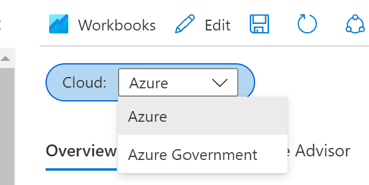

To import the workbook:
1. Navigate to Monitor in the Azure Portal
2. Workbooks
3. New 
4. Advanced Editor (</>) 
5. Paste json into Gallery Template 
6. Apply
7. Click "Done Editing" and click "Save" icon to save the workbook
8. Pick the right cloud environment - "Azure" for public cloud and "Azure Government" for Government cloud tenants 